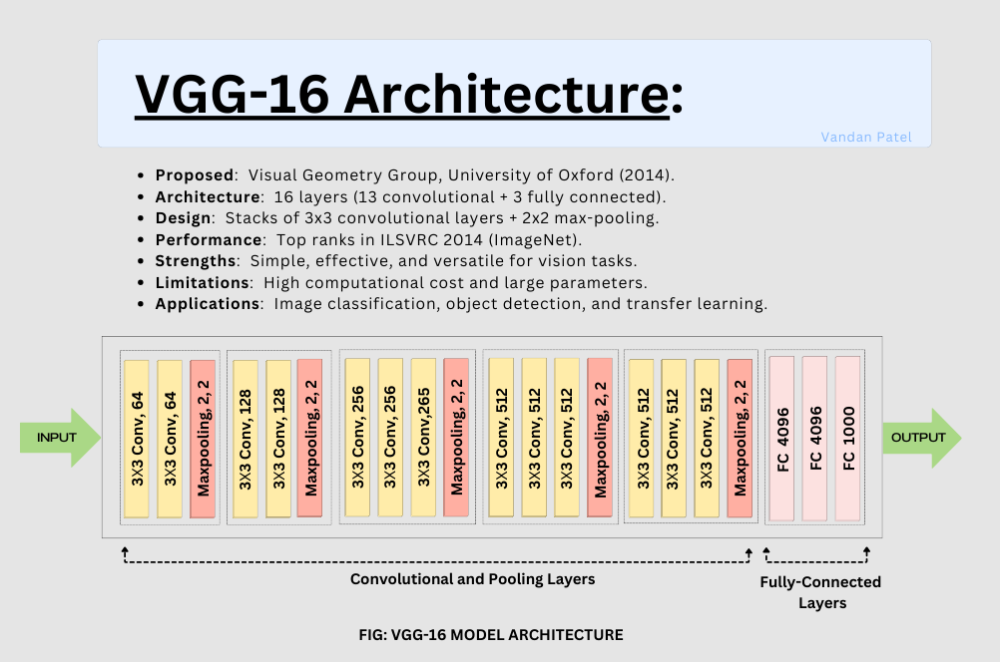

# VGG-16 CNN Fine-Tuning for Cat vs Dog Classification 🐱🐶  

This project implements **VGG-16**, a widely-used Convolutional Neural Network (CNN) architecture, to classify images of cats and dogs. By leveraging transfer learning and fine-tuning techniques, the model achieves an impressive **91.71% accuracy** on the Cats vs Dogs dataset.  

## 🖼️ Model Architecture  
The VGG-16 model architecture consists of 16 layers, including convolutional layers, max-pooling layers, and fully connected layers. The model is known for its simplicity and effectiveness in image classification tasks. Below is a visual representation of the VGG-16 architecture:



---

## 🚀 Features  
- **Pretrained VGG-16 Model**: Utilizes the VGG-16 architecture pretrained on ImageNet.  
- **Fine-Tuning Techniques**: Optimized for high performance on the Cats vs Dogs dataset.  
- **Efficient Training Pipeline**: Includes preprocessing, augmentation, training, and evaluation.  
- **High Accuracy**: Demonstrates competitive results with minimal adjustments.  

---

## 📂 Dataset  
The model is trained on the **Cats vs Dogs dataset** from Kaggle, consisting of thousands of labeled images of cats and dogs. You can download the dataset from [this link](https://www.kaggle.com/datasets/salader/dogs-vs-cats).  

### Dataset Preparation  
1. Download the dataset from [Kaggle Cats vs Dogs](https://www.kaggle.com/c/dogs-vs-cats/data).  
2. Extract the dataset and organize it as follows:  
   ```plaintext
   dataset/
   ├── train/
   │   ├── cats/
   │   └── dogs/
   └── test/
       ├── cats/
       └── dogs/
---


## 🛠️ Installation

### Prerequisites
- Python 3.7 or higher
- Ensure you have pip installed

### Clone the Repository
```bash
git clone https://github.com/yourusername/VGG-16-Fine-Tuning.git
cd VGG-16-Fine-Tuning
```

### Installation
```bash
pip install -r requirements.txt
```

---

## 📈 Improving Accuracy


To further improve the model's accuracy, consider implementing the following techniques:

### 🔄 Data Augmentation
Enhance model robustness with real-time transformations such as:
- **Rotation**: Randomly rotate images.
- **Zoom**: Apply random zooming.
- **Horizontal Flip**: Flip images horizontally.
- **Brightness Adjustment**: Vary image brightness.

### 🧠 Advanced Techniques
- **Learning Rate Scheduling**: Adjust the learning rate dynamically during training.
- **Regularization**: Apply techniques like dropout to prevent overfitting.
- **Ensemble Methods**: Combine predictions from multiple models to improve accuracy.
- **Hyperparameter Tuning**: Experiment with different hyperparameters to find the optimal settings.

### 🧪 Experimentation
- **Try Different Optimizers**: Experiment with optimizers like Adam, RMSprop, or SGD.
- **Increase Model Depth**: Add more layers or units to the model.
- **Transfer Learning**: Use other pretrained models like ResNet or Inception.

Implementing these techniques can help push the model's performance even further.

---
